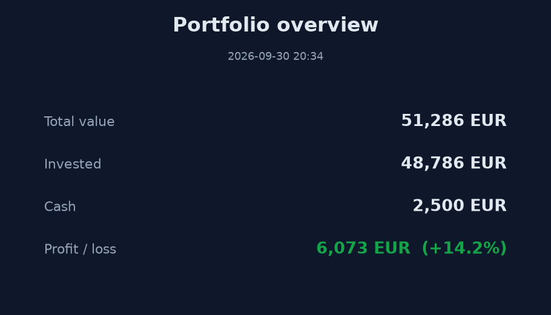
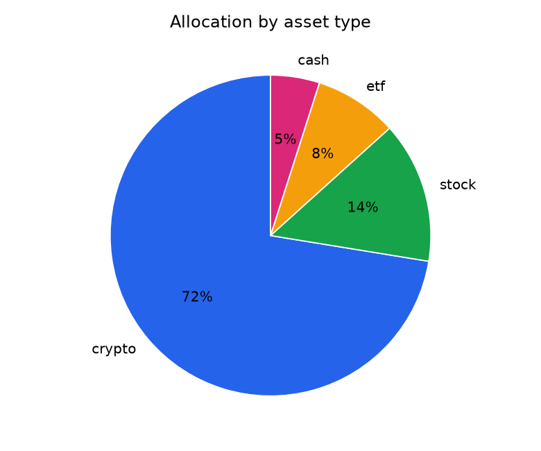
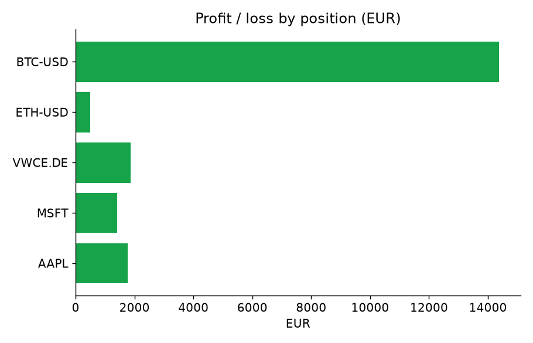

# eToro Portfolio Stats → Telegram

A small Python app that turns an eToro (or any broker's) portfolio into a Telegram update: it prices your holdings with live
market data, computes statistics on your net worth and investments, renders an overview card and charts,
and posts everything to a Telegram chat. Run it by hand or on a schedule.

## Data sources

The data source is pluggable (`PORTFOLIO_SOURCE`):

- **`etoro`** — the official [eToro public API](https://api-portal.etoro.com/). Create an API key pair
  (Settings → Trading → API Key Management) and set `ETORO_API_KEY` and `ETORO_USER_KEY`. The app reads
  your aggregated portfolio and balances and uses eToro's own current rates.
- **`csv`** — read holdings from a CSV (see below). Works with any broker: export your positions, or keep
  them by hand. Live prices are fetched from Yahoo Finance, so the CSV only needs quantities and average
  open prices. This is also a good fallback for eToro (export via **Settings → Account → Account
  Statement**).
- **`demo`** — a sample portfolio, to try the app with no data of your own.

> **Note on the eToro adapter:** it targets the documented endpoints and auth
> (`https://public-api.etoro.com/api/v1`, `x-api-key` / `x-user-key` headers), and reads the responses
> defensively, but it has not been run against a live key here. Verify the field mapping in
> [`providers/etoro.py`](portfolio_stats/providers/etoro.py) against your account's responses. The `csv`
> source needs no API access and works out of the box.

## What it produces

- An **overview card** (a rendered image) with total value, invested amount, cash and profit/loss.
- An **allocation** pie chart by asset type.
- A **profit/loss by position** bar chart.
- A **total value over time** line chart, once at least two runs have been recorded.
- A text summary with the top holdings.

All of this is posted to Telegram as a message followed by an image album.

### Example output

Generated by `python -m portfolio_stats --source demo` with live prices (the "value over time" chart
appears once at least two runs have been recorded):



| Allocation by asset type | Profit / loss by position |
|---|---|
|  |  |

## Holdings CSV

`data/sample_holdings.csv` shows the format:

```csv
symbol,name,quantity,avg_open_price,asset_type
AAPL,Apple Inc.,12,150,stock
VWCE.DE,Vanguard FTSE All-World,25,95,etf
BTC-USD,Bitcoin,0.4,38000,crypto
CASH,Cash balance,2500,1,cash
```

- `symbol` is a [Yahoo Finance](https://finance.yahoo.com) ticker — e.g. `AAPL`, European ETFs like
  `VWCE.DE`, crypto like `BTC-USD`. This is how prices are looked up.
- `avg_open_price` is your average buy price, in `BASE_CURRENCY`.
- A row with `asset_type=cash` adds to the cash balance (`quantity * avg_open_price`); use
  `quantity=<amount>, avg_open_price=1`.

Your own CSV is git-ignored, so it never ends up in the repository.

## Setup

Requirements: Python 3.10+.

```bash
pip install -r requirements.txt
cp .env.example .env      # then fill it in
```

**Telegram:** create a bot with [@BotFather](https://t.me/BotFather) to get `TELEGRAM_BOT_TOKEN`, send it
a message, then get your `TELEGRAM_CHAT_ID` from [@userinfobot](https://t.me/userinfobot). Put both in
`.env`.

## Run

```bash
# Render only, print the summary and image paths, do not post
python -m portfolio_stats --no-send

# Use your CSV and post to Telegram
PORTFOLIO_SOURCE=csv PORTFOLIO_CSV=data/my_holdings.csv python -m portfolio_stats
```

Settings come from the environment (or `.env`); `--source` overrides `PORTFOLIO_SOURCE` for one run.

### On a schedule

- **Linux/macOS (cron), every day at 18:00:**
  ```cron
  0 18 * * * cd /path/to/portfolio-stats && /path/to/python -m portfolio_stats
  ```
- **Windows:** use Task Scheduler to run `python -m portfolio_stats` in this folder.

Each run appends a value snapshot to a local SQLite file (`DB_PATH`), which feeds the "value over time"
chart.

## Configuration

| Variable | Default | Description |
|---|---|---|
| `TELEGRAM_BOT_TOKEN` | – | Bot token from BotFather |
| `TELEGRAM_CHAT_ID` | – | Chat to post into |
| `PORTFOLIO_SOURCE` | `demo` | `demo`, `csv` or `etoro` |
| `PORTFOLIO_CSV` | `data/sample_holdings.csv` | Holdings CSV when source is `csv` |
| `ETORO_API_KEY` / `ETORO_USER_KEY` | – | eToro API credentials when source is `etoro` |
| `ETORO_ACCOUNT` | `real` | `real` or `demo` eToro account |
| `BASE_CURRENCY` | `USD` | Currency your holdings are in |
| `DB_PATH` | `portfolio_history.db` | SQLite file for value history |
| `OUTPUT_DIR` | `output` | Where images are written |

When the Telegram variables are unset, the app just prints the summary and writes the images locally.

## Tests

```bash
pytest
```

## Notes

- Prices come from Yahoo Finance via [`yfinance`](https://github.com/ranaroussi/yfinance), an unofficial
  library. Treat the figures as indicative.
- This tool does not place trades. It only reads prices and reports on holdings you provide.

## Tech stack

Python · yfinance · Matplotlib · SQLite · Telegram Bot API

## License

[MIT](LICENSE)
